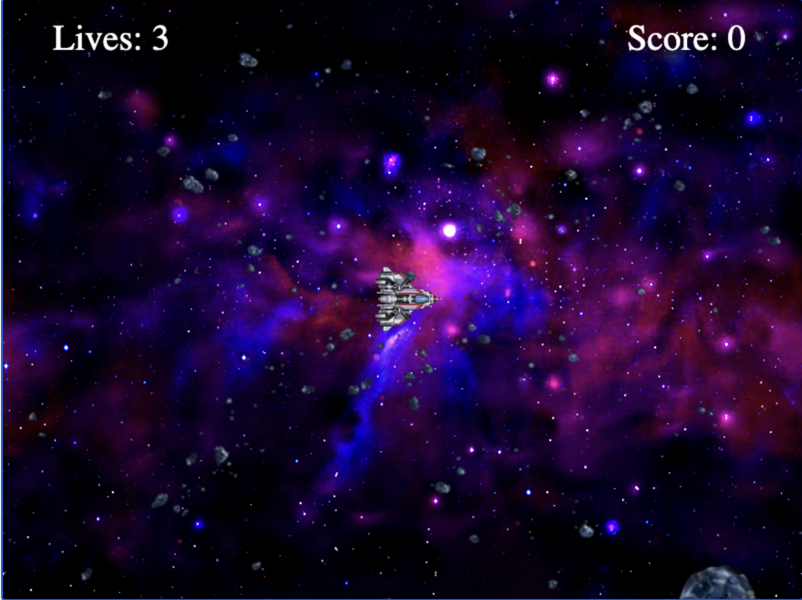

# Spaceship

This repository contains a Python implementation of a 2D space game inspired by the classic arcade game Asteroids, developed using SimpleGUI. The game was developed as part of my minor in Interactive Programming in Python, which is part of the "Fundamentals of Computing Specialization" by Rice University on Coursera.

## Overview

In this game, the player controls a spaceship using keyboard inputs to navigate and shoot missiles at asteroids. The objective is to destroy the asteroids before they collide with the spaceship. The game includes realistic physics for movement, rotation, and screen wrapping.

## Features

- **Spaceship Control**: Use arrow keys to rotate and thrust the spaceship.
- **Missile Firing**: Press the spacebar to shoot missiles.
- **Asteroids**: Rocks spawn randomly and travel across the screen.
- **Screen Wrapping**: The spaceship and asteroids wrap around the screen edges.
- **Score and Lives**: Display current score and remaining lives.

## How to Play

1. **Start the Game**: Run the game script to start.
2. **Control the Spaceship**:
   - Left Arrow: Rotate counter-clockwise.
   - Right Arrow: Rotate clockwise.
   - Up Arrow: Thrust forward.
3. **Shoot Missiles**: Press the spacebar to fire missiles.
4. **Objective**: Destroy the asteroids before they collide with your spaceship.

## Installation

To run this project, you'll need Python and SimpleGUI installed. You can install SimpleGUI using the following command:

```sh
pip install simplegui
```

## Running the Game

1. Clone this repository:

```sh
git clone https://github.com/Hridxyz/interactive-python-games.git
```

2. Navigate to the Spaceship directory and run the game script:

```sh
cd interactive-python-games/Spaceship
python Spaceship.py
```

## Screenshot



## Example Output

```plaintext
Lives: 3
Score: 0
```

## Acknowledgements

This game was developed as part of the "Fundamentals of Computing Specialization" by Rice University on Coursera. Special thanks to the instructors Scott Rixner, Joe Warren, and Luay Nakhleh for their guidance.
